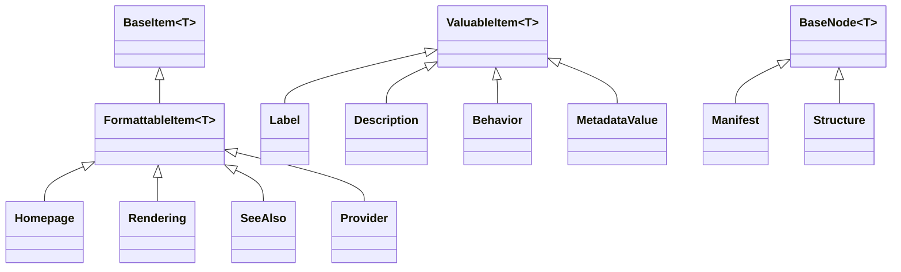

# Data / Configurations

## Contents

- [Overview](#overview)
- [Files](#files)
- [Types](#types)
  - [ManifestEntityConfiguration](#manifestentityconfiguration)
  - [OwnedMappingHelpers](#ownedmappinghelpers)
- [Diagrams](#diagrams)
- [See also](#see-also)

## Overview

This is the actual EF Core mapping: how [`ManifestEntity`](../../Domain/README.md) owns the IIIF Manifest Serializer SDK's `Manifest`/`Structure` node graph, table by table. `ManifestEntityConfiguration` wires the root and the manifest-specific properties; `OwnedMappingHelpers` holds the generic, reusable mapping for every shape the SDK's node hierarchy repeats (labels, summaries, metadata, behavior, links, providers) so it's written once instead of once per owner.

The SDK's own object model is used directly as the EF Core entity model — there is no hand-maintained mirror of it. What the SDK exposes only as polymorphic or fully-nested graphs (canvas ordering, range items, `start`, placeholder/accompanying canvases) is not forced into a relational shape; it round-trips through targeted `jsonb` columns instead (see [Diagrams](#diagrams) and [`Data.IiifJsonSettings`](../README.md#iiifjsonsettings)).

## Files

| File | Primary type(s) | Responsibility |
|---|---|---|
| `ManifestEntityConfiguration.cs` | `ManifestEntityConfiguration` | Maps `ManifestEntity`, the owned `Manifest`, and the owned `Structure` collection |
| `OwnedMappingHelpers.cs` | `OwnedMappingHelpers` | Generic mapping for the SDK's `BaseItem`/`FormattableItem`/`ValuableItem`/`BaseNode` hierarchy, plus the JSONB conversions |

## Types

| Type | Kind | Summary |
|---|---|---|
| `ManifestEntityConfiguration` | `sealed class : IEntityTypeConfiguration<ManifestEntity>` | Root mapping for `manifests` |
| `OwnedMappingHelpers` | `internal static class` | Reusable owned-type and JSONB mapping helpers |

### ManifestEntityConfiguration

- **Namespace:** `IIIF.POC.PostgreSqlRelationalV3Store.Data.Configurations`
- Maps `ManifestEntity` to the `manifests` table:
  - `Id` is the primary key (`pk_manifests`), never database-generated.
  - The shadow properties from [`ManifestEntity`](../../Domain/README.md#manifestentity) become the `list_iiif_id`, `list_label`, `source_version`, `content_hash`, `canvas_count`, `structure_count`, `created_at_utc`, `updated_at_utc`, and `version` columns — `version` is the PostgreSQL `xmin`-backed row-version token (`IsRowVersion()`) used for optimistic concurrency in [`ManifestStoreService`](../../Services/README.md#manifeststoreservice). A unique index on `list_iiif_id`, plus indexes on `updated_at_utc` and `content_hash`, back the list/search queries.
  - `Manifest` is owned (`OwnsOne`) via `OwnedMappingHelpers.ConfigureBaseNode`, plus Manifest-specific mapping: the 2.x-only computed views (`Sequences`, `AdditionalSequences`, `Services`) are ignored since they're not their own storage; `NavDate`/`ViewingDirection` are scalar columns (`ViewingDirection` converts to/from the SDK's `ViewingDirection` value type); `Structures` (the manifest's Ranges) are owned via `ConfigureStructure`; and `Items` (canvas ordering), `Start`, and `PlaceholderCanvas` round-trip through `jsonb` (see [`OwnedMappingHelpers`](#ownedmappinghelpers) below). A GIN index on `Items` supports containment queries against the embedded JSON.
- **Key Methods:**
  - `Configure(EntityTypeBuilder<ManifestEntity>)` — the `IEntityTypeConfiguration<ManifestEntity>` entry point.
  - `ConfigureStructure(OwnedNavigationBuilder<Manifest, Structure>, prefix, ownerForeignKey)` *(private)* — maps a `range` row: `ConfigureBaseNode` for the shared surface, the 2.x-only `Canvases`/`Ranges`/`Members` views ignored, `StartCanvas`/`ViewingDirection` as scalars, and `Items` (mixed canvas/range/nested-structure references) through the polymorphic JSONB conversion.
- **Usage Recipe:** configurations are discovered automatically — see [`ManifestStoreDbContext.OnModelCreating`](../README.md#manifeststoredbcontext); there's nothing to call directly.

### OwnedMappingHelpers

- **Namespace:** `IIIF.POC.PostgreSqlRelationalV3Store.Data.Configurations`
- Generic helpers, layered to match the SDK's own type hierarchy so each mapping rule is written exactly once:

  | Method | Maps | Notes |
  |---|---|---|
  | `BaseItemMapping<TEntity, TRelatedEntity>` | any `BaseItem<T>` (e.g. `PartOf`) | `id`/`type`/`context` columns; ignores `HasChanges`/`Service` |
  | `FormattableItemMapping<TEntity, TRelatedEntity>` | any `FormattableItem<T>` | adds `format` |
  | `DimensionedFormattableItemMapping<TEntity, TRelatedEntity>` | thumbnails/logos | adds `height`/`width` |
  | `ValuableItemMapping<TEntity, TRelatedEntity>` | any `ValuableItem<T>` (bare or language-tagged value) | surrogate `Guid` row key, since the value and language tag can both repeat/be null |
  | `LabelMapping` / `SummaryMapping` / `BehaviorMapping` / `MetadataValueMapping` | `Label`, `Description`, `Behavior`, `MetadataValue` | thin `ValuableItemMapping` wrappers adding `language` where applicable |
  | `HomepageMapping` / `RenderingMapping` / `SeeAlsoMapping` | link-shaped items | thin `FormattableItemMapping` wrappers adding `label`/`profile` |
  | `ProviderMapping<TEntity>` | `Provider` (an agent) | owns its own labels/homepages/logos/seeAlso three ownership levels deep from the root, which needs the shadow FK's type declared explicitly before EF can infer it |
  | `Metadata<TOwner>` | a node's `Metadata` list | keyed by `Label`, owns a `MetadataValue` collection |
  | `RequiredStatement<TOwner>` | a node's `RequiredStatement` | surrogate key, since it has no natural id of its own and is nested arbitrarily deep |
  | `ConfigureBaseNode<TOwner, TNode>` | any `BaseNode<T>` (`Manifest`, `Structure`) | the shared surface every node carries — see below |
  | `JsonGraph<T>` | a single embedded SDK node (`Start`, `PlaceholderCanvas`, a node's `AccompanyingCanvas`) | `jsonb` column via `Data.IiifJsonSettings.Graph` |
  | `ManifestItemsMapping` | `Manifest.Items` | `jsonb`, always `List<Canvas>`, via `IiifJsonSettings.Graph` |
  | `StructureItemsMapping` | `Structure.Items` | `jsonb`, mixed reference types, via `IiifJsonSettings.Polymorphic` (needs `$type`) |

- **`ConfigureBaseNode<TOwner, TNode>`** is the center of the file: it configures everything a `BaseNode<TNode>` carries in common — label, summary, metadata, required statement, behavior, homepage, thumbnail, logo, rendering, seeAlso, partOf, provider, the scalar `rights` (converted to/from the SDK's `Rights` value type), and the JSON-embedded `accompanyingCanvas` — plus ignoring the six 2.x-only computed properties (`Description`, `Attribution`, `License`, `ViewingHint`, `Within`, `Related`) that mirror other fields and aren't their own storage. Callers (`ManifestEntityConfiguration`) still own the node's own key and type-specific members.
- **Value comparers:** `StringCollectionComparer` and `BaseItemCollectionComparer` give EF Core structural (not reference) equality for the `context` string array and the JSONB-backed `IReadOnlyCollection<IBaseItem>` properties, so change tracking doesn't flag them as modified on every save.
- **Usage Recipe:**

  ```csharp
  builder.OwnsMany(x => x.Label, label =>
      LabelMapping(label, "manifest_labels", "manifest_id"));
  ```

## Diagrams

### SDK type hierarchy this file maps



Each SDK base type has exactly one mapping helper (`BaseItemMapping`, `FormattableItemMapping`, `ValuableItemMapping`, `ConfigureBaseNode`); every leaf type reuses it instead of repeating the same `HasColumnName` calls.

### What `ConfigureBaseNode` wires up

```mermaid
graph TD
    CBN[ConfigureBaseNode prefix] --> Label[Label via LabelMapping]
    CBN --> Summary[Summary via SummaryMapping]
    CBN --> Metadata[Metadata]
    CBN --> RS[RequiredStatement]
    CBN --> Behavior[Behavior via BehaviorMapping]
    CBN --> Homepage[Homepage via HomepageMapping]
    CBN --> Thumbnail[Thumbnail via DimensionedFormattableItemMapping]
    CBN --> Logo[Logo via DimensionedFormattableItemMapping]
    CBN --> Rendering[Rendering via RenderingMapping]
    CBN --> SeeAlso[SeeAlso via SeeAlsoMapping]
    CBN --> PartOf[PartOf via BaseItemMapping]
    CBN --> Provider[Provider via ProviderMapping]
    CBN --> Rights[Rights, scalar conversion]
    CBN --> Accompanying[AccompanyingCanvas, jsonb via JsonGraph]
```



`Manifest` and `Structure` each call this once, then add only what's genuinely different: `Manifest` adds `NavDate`, `Structures`, `Items` (`List<Canvas>`), `Start`, `PlaceholderCanvas`; `Structure` adds `StartCanvas` and its own polymorphic `Items`.

## See also

- [Domain](../../Domain/README.md) — `ManifestEntity`, the type this configuration targets
- [Data](../README.md) — `IiifJsonSettings`, shared by the JSONB conversions above
- [Migrations](../../Migrations/README.md) — the schema this mapping produces

[↑ Back to top](#contents)
