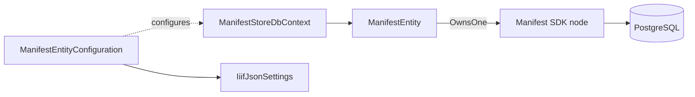

# Data

## Contents

- [Overview](#overview)
- [Files](#files)
- [Types](#types)
  - [ManifestStoreDbContext](#manifeststoredbcontext)
  - [IiifJsonSettings](#iiifjsonsettings)
- [Package Dependencies](#package-dependencies)
- [Diagrams](#diagrams)
- [See also](#see-also)

## Overview

The EF Core / PostgreSQL boundary: the `DbContext` itself, plus the Newtonsoft settings shared by the JSONB conversions that live one level down in [Configurations](Configurations/README.md).

## Files

| File | Primary type(s) | Responsibility |
|---|---|---|
| `ManifestStoreDbContext.cs` | `ManifestStoreDbContext` | The single `DbSet<ManifestEntity>` and configuration wiring |
| `IiifJsonSettings.cs` | `IiifJsonSettings` | Shared `JsonSerializerSettings` for the SDK-node ↔ JSONB conversions |

## Types

| Type | Kind | Summary | Inherits/Implements |
|---|---|---|---|
| `ManifestStoreDbContext` | `sealed class` | The application's only `DbContext` | `DbContext` |
| `IiifJsonSettings` | `internal static class` | Newtonsoft settings for jsonb-embedded SDK graphs | — |

### ManifestStoreDbContext

- **Namespace:** `IIIF.POC.PostgreSqlRelationalV3Store.Data`
- **Key Properties:** `Manifests : DbSet<ManifestEntity>`
- **Constructors:** primary constructor taking `DbContextOptions<ManifestStoreDbContext>`, registered via `AddDbContext` in [`Program.cs`](../../README.md) with Npgsql retry-on-failure enabled.
- `OnModelCreating` applies every `IEntityTypeConfiguration<T>` in the assembly — currently just [`ManifestEntityConfiguration`](Configurations/README.md#manifestentityconfiguration) — rather than configuring the model inline.
- **Usage Recipe:**

  ```csharp
  builder.Services.AddDbContext<ManifestStoreDbContext>(options =>
      options.UseNpgsql(connectionString,
          npgsql => npgsql.EnableRetryOnFailure(5, TimeSpan.FromSeconds(3), null)));
  ```

### IiifJsonSettings

- **Namespace:** `IIIF.POC.PostgreSqlRelationalV3Store.Data`
- **Key Members:**
  - `Graph : JsonSerializerSettings` — used for the SDK's own contract resolver (`IIIFJsonContractResolver`) with no polymorphism, for values whose concrete type is already known from the column (e.g. `Manifest.Start`, `Manifest.PlaceholderCanvas`, and `Manifest.Items`, which is always `List<Canvas>`).
  - `Polymorphic : JsonSerializerSettings` — the same resolver plus `TypeNameHandling.Auto` and `MetadataPropertyHandling.ReadAhead`, for `Structure.Items`, which mixes canvas/range references and nested structures and so needs `$type` metadata to round-trip. `ReadAhead` is required because the SDK serializes `@id` before `$type`, which the default metadata handling can't tolerate.
- Both settings back the `HasConversion` calls in [`OwnedMappingHelpers.JsonGraph`, `.ManifestItemsMapping`, and `.StructureItemsMapping`](Configurations/README.md#ownedmappinghelpers) — the same instance serializes on write and deserializes on read, so the two sides can't drift apart.

## Package Dependencies

| Package | Version | Description | Links |
|---|---|---|---|
| `Microsoft.EntityFrameworkCore` | 10.0.11 | EF Core runtime | [NuGet](https://www.nuget.org/packages/Microsoft.EntityFrameworkCore) |
| `Npgsql.EntityFrameworkCore.PostgreSQL` | 10.0.3 | PostgreSQL provider for EF Core | [NuGet](https://www.nuget.org/packages/Npgsql.EntityFrameworkCore.PostgreSQL) |
| `IIIF.Manifest.Serializer.Net` | 3.0.17 | IIIF Presentation parsing/validation/serialization; supplies the `Manifest`/`Structure` node graph this project maps | [NuGet](https://www.nuget.org/packages/IIIF.Manifest.Serializer.Net) · [GitHub](https://github.com/KiarashMinoo/IIIF.Manifest.Serializer.Net) |

The full, project-wide dependency list is in the [root README](../../README.md#package-dependencies).

## Diagrams

### Component overview



`ManifestStoreDbContext` never touches `IiifJsonSettings` directly — it's consumed inside the owned-type configuration, which the context discovers via `ApplyConfigurationsFromAssembly`.

## See also

- [Configurations](Configurations/README.md) — where the DbContext's model is actually built
- [Domain](../Domain/README.md) — the `ManifestEntity` the context tracks

[↑ Back to top](#contents)
