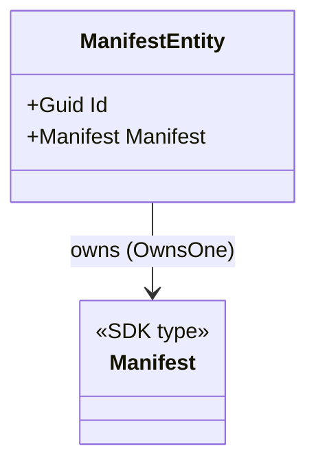

# Domain

## Contents

- [Overview](#overview)
- [Files](#files)
- [Types](#types)
  - [ManifestEntity](#manifestentity)
- [Diagrams](#diagrams)
- [See also](#see-also)

## Overview

The aggregate root persisted by [`ManifestStoreDbContext`](../Data/README.md). `ManifestEntity` wraps the IIIF Manifest Serializer SDK's own `Manifest` node so it can be mapped as an EF Core owned type instead of being re-modeled by hand — see [Data/Configurations](../Data/Configurations/README.md) for how that mapping works.

## Files

| File | Primary type(s) | Responsibility |
|---|---|---|
| `ManifestEntity.cs` | `ManifestEntity` | Aggregate root: a surrogate `Guid` key plus the owned `Manifest` node |

## Types

| Type | Kind | Summary | Key Members |
|---|---|---|---|
| `ManifestEntity` | `sealed class` | Row identity + the owned SDK `Manifest` | `Id`, `Manifest`, shadow-property name constants |

### ManifestEntity

- **Namespace:** `IIIF.POC.PostgreSqlRelationalV3Store.Domain`
- **Key Properties:**
  - `Id : Guid` — the row's own identity; generated client-side (`Guid.NewGuid()`) rather than by the database, so it's known before the first `SaveChanges`.
  - `Manifest : Manifest` — the SDK node, mapped with `OwnsOne` in [`ManifestEntityConfiguration`](../Data/Configurations/README.md#manifestentityconfiguration).
- **Shadow-property name constants:** `IiifId`, `Label`, `SourceVersion`, `ContentHash`, `CanvasCount`, `StructureCount`, `CreatedAtUtc`, `UpdatedAtUtc`, `Version`. These are not CLR properties — they're `nameof`-derived string constants used to address EF Core [shadow properties](../Data/Configurations/README.md#manifestentityconfiguration) (columns with no backing field on the class) from [`ManifestStoreService`](../Services/README.md#manifeststoreservice) via `EF.Property<T>(...)`. The pattern keeps the searchable/orderable projection of a manifest (IIIF id, display label, counts, timestamps, the optimistic-concurrency token) out of the CLR type while still giving callers compile-time-checked names instead of magic strings.
- **Usage Recipe:**

  ```csharp
  var entity = new ManifestEntity { Id = Guid.NewGuid(), Manifest = parsedManifest };
  var entry = db.Manifests.Add(entity);
  entry.Property(ManifestEntity.CreatedAtUtc).CurrentValue = DateTimeOffset.UtcNow;
  ```

## Diagrams

### Composition



`ManifestEntity` itself carries no IIIF-shaped properties; every Presentation field lives on the SDK's `Manifest` and is reached through the `Manifest` navigation.

## See also

- [Data/Configurations](../Data/Configurations/README.md) — how `ManifestEntity` and its shadow properties are mapped to columns
- [Services](../Services/README.md) — where the shadow properties are read and written

[↑ Back to top](#contents)
