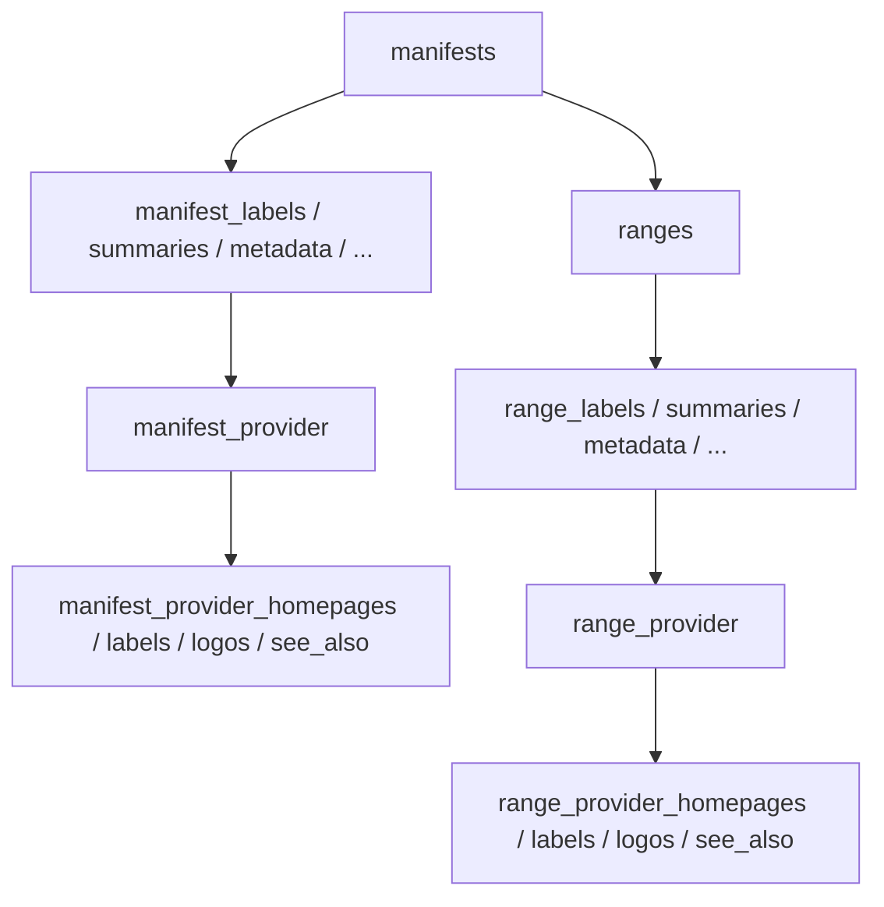

# Migrations

## Contents

- [Overview](#overview)
- [Files](#files)
- [Schema produced](#schema-produced)
- [Diagrams](#diagrams)
- [See also](#see-also)

## Overview

`Migrations` holds the single EF Core migration generated from the model in [Data/Configurations](../Data/Configurations/README.md). It's committed for `dotnet ef database update` in environments that prefer applying a migration over the POC's own startup path — [`Program.cs`](../../README.md#run) calls `EnsureCreatedAsync()` instead and does not apply this migration automatically. Every file here is generated by `dotnet ef migrations add`; none of it is hand-edited.

## Files

| File | Primary type(s) | Responsibility |
|---|---|---|
| `20260805185410_InitialCreate.cs` | `InitialCreate` | The migration's `Up`/`Down` — creates every table, foreign key, and index |
| `20260805185410_InitialCreate.Designer.cs` | `InitialCreate` (partial, `[DbContext]`-attributed) | The model snapshot EF Core diffs against for this specific migration |
| `ManifestStoreDbContextModelSnapshot.cs` | `ManifestStoreDbContextModelSnapshot` | The current, cumulative model snapshot used to compute the *next* migration |

## Schema produced

One root table plus one owned-collection table per `BaseNode`/`BaseItem`-shaped property from [Data/Configurations](../Data/Configurations/README.md#ownedmappinghelpers), repeated identically under the `manifest_` and `range_` prefixes:

- `manifests` — the aggregate root; `list_iiif_id` (unique), `list_label`, `source_version`, `content_hash`, `canvas_count`, `structure_count`, `created_at_utc`, `updated_at_utc`, `version` (the `xmin` concurrency token), plus the `manifest`-prefixed columns owned directly on the row (`iiif_id`, `type`, `context`, `nav_date`, `viewing_direction`, `rights`, the `items`/`start`/`placeholder_canvas`/`manifest_accompanying_canvas` `jsonb` columns).
- `ranges` — one row per `Manifest.Structures` entry, foreign-keyed to `manifests`; same shared-node columns as above under the `range_` prefix, plus `start_canvas` and its own `items` `jsonb` column.
- Per-node collection tables, each foreign-keyed to its owner (`manifest_id` or `range_id`): `*_labels`, `*_summaries`, `*_metadata` (→ `*_metadata_values`), `*_required_statement` (→ `*_required_statement_labels`, `*_required_statement_values`), `*_behavior`, `*_homepage`, `*_thumbnail`, `*_logo`, `*_rendering`, `*_see_also`, `*_part_of`, `*_provider` (→ `*_provider_homepages`, `*_provider_labels`, `*_provider_logos`, `*_provider_see_also`).

Every foreign key cascades on delete, so removing a `manifests` row (or a `ranges` row) removes its entire owned subtree — see [`ManifestStoreService.PurgeOwnedRowsAsync`](../Services/README.md#manifeststoreservice) for the one case (updates) that deletes the direct children explicitly before PostgreSQL cascades the rest.

## Diagrams

### Table ownership

`ranges` and every `manifest_*` table mirror the same shape under `range_*`, because both are generated from the single `ConfigureBaseNode` helper in [Data/Configurations](../Data/Configurations/README.md#ownedmappinghelpers) against the same table naming rules.

## See also

- [Data/Configurations](../Data/Configurations/README.md) — the mapping this schema is generated from
- [Services](../Services/README.md) — `PurgeOwnedRowsAsync`, which deletes directly-owned rows before an update

[↑ Back to top](#contents)
