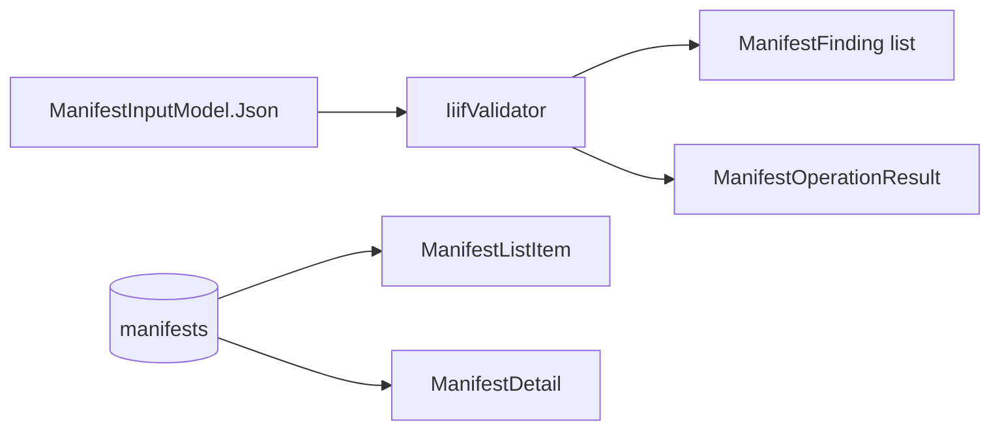

# Models

## Contents

- [Overview](#overview)
- [Files](#files)
- [Types](#types)
  - [ManifestListItem](#manifestlistitem)
  - [ManifestDetail](#manifestdetail)
  - [ManifestInputModel](#manifestinputmodel)
  - [ManifestOperationResult](#manifestoperationresult)
  - [ManifestFinding](#manifestfinding)
- [Diagrams](#diagrams)
- [See also](#see-also)

## Overview

Page-facing DTOs produced and consumed by [`ManifestStoreService`](../Services/README.md#manifeststoreservice). Nothing here is an EF Core entity — these are the shapes [Pages/Manifests](../Pages/Manifests/README.md) actually bind to and render.

## Files

| File | Primary type(s) | Responsibility |
|---|---|---|
| `ManifestListItem.cs` | `ManifestListItem` | One row of the manifest list/search results |
| `ManifestDetail.cs` | `ManifestDetail` | A single manifest's metadata plus its full SDK `Manifest` node |
| `ManifestInputModel.cs` | `ManifestInputModel` | The create/edit form's bound input |
| `ManifestOperationResult.cs` | `ManifestOperationResult` | The outcome of a create/update/delete call |
| `ManifestFinding.cs` | `ManifestFinding` | One SDK validation error, reported back to the page |

## Types

| Type | Kind | Key Members |
|---|---|---|
| `ManifestListItem` | `sealed record` | `Id`, `IiifId`, `Label`, `SourceVersion`, `CanvasCount`, `StructureCount`, `UpdatedAtUtc`, `Version` |
| `ManifestDetail` | `sealed record` | `Id`, `IiifId`, `SourceVersion`, `ContentHash`, `CreatedAtUtc`, `UpdatedAtUtc`, `Version`, `Node : Manifest` |
| `ManifestInputModel` | `sealed class` | `Json` (`[Required]`), `Version` |
| `ManifestOperationResult` | `sealed class` | `Succeeded`, `ConcurrencyConflict`, `Id`, `Error`, `Findings` |
| `ManifestFinding` | `sealed record` | `RuleId`, `Severity`, `Path`, `Message` |

### ManifestListItem

- **Namespace:** `IIIF.POC.PostgreSqlRelationalV3Store.Models`
- Projected directly from the `manifests` shadow properties by [`ManifestStoreService.ListAsync`](../Services/README.md#manifeststoreservice) — one row per manifest, no owned collections loaded.
- **Usage Recipe:** rendered as a table row in [`Pages/Manifests/Index.cshtml`](../Pages/Manifests/README.md#indexmodel).

### ManifestDetail

- **Namespace:** `IIIF.POC.PostgreSqlRelationalV3Store.Models`
- `Node` is the full SDK `Manifest` graph (labels, items, structures, providers, everything) as loaded from the owned columns/JSONB. Used wherever a page needs more than the list projection — [Details](../Pages/Manifests/README.md#detailsmodel), [Edit](../Pages/Manifests/README.md#editmodel), and [Delete](../Pages/Manifests/README.md#deletemodel).
- **Usage Recipe:**

  ```csharp
  var detail = await store.FindAsync(id, cancellationToken);
  var label = IiifLabelFormatter.FirstOrDefault(detail.Node.Label);
  ```

### ManifestInputModel

- **Namespace:** `IIIF.POC.PostgreSqlRelationalV3Store.Models`
- **Validation:** `Json` is `[Required]` via `System.ComponentModel.DataAnnotations`; that's the only server-side validation before the raw text reaches the SDK's own `IiifValidator`.
- `Version` round-trips the row's concurrency token through the edit form as a hidden field so [`ManifestStoreService.UpdateAsync`](../Services/README.md#manifeststoreservice) can detect a conflicting edit.

### ManifestOperationResult

- **Namespace:** `IIIF.POC.PostgreSqlRelationalV3Store.Models`
- The uniform return shape for create/update/delete: `Succeeded` and `Error` cover the normal validation/persistence outcome; `ConcurrencyConflict` distinguishes a `DbUpdateConcurrencyException` specifically, so the page can show "reload before saving again" instead of a generic error; `Findings` always carries whatever the SDK validator reported, even on success.

### ManifestFinding

- **Namespace:** `IIIF.POC.PostgreSqlRelationalV3Store.Models`
- One entry per SDK validation error (`RuleId`, `Severity`, JSON `Path`, `Message`), rendered by the [`_Findings` partial](../Pages/Shared/README.md#_findingscshtml).

## Diagrams

### From request to result



`ManifestFinding` is the only type populated straight from SDK validation output; the rest are shaped by [`ManifestStoreService`](../Services/README.md#manifeststoreservice) for a specific page.

## See also

- [Services](../Services/README.md) — where every one of these types is constructed
- [Pages/Manifests](../Pages/Manifests/README.md) — where they're consumed

[↑ Back to top](#contents)
