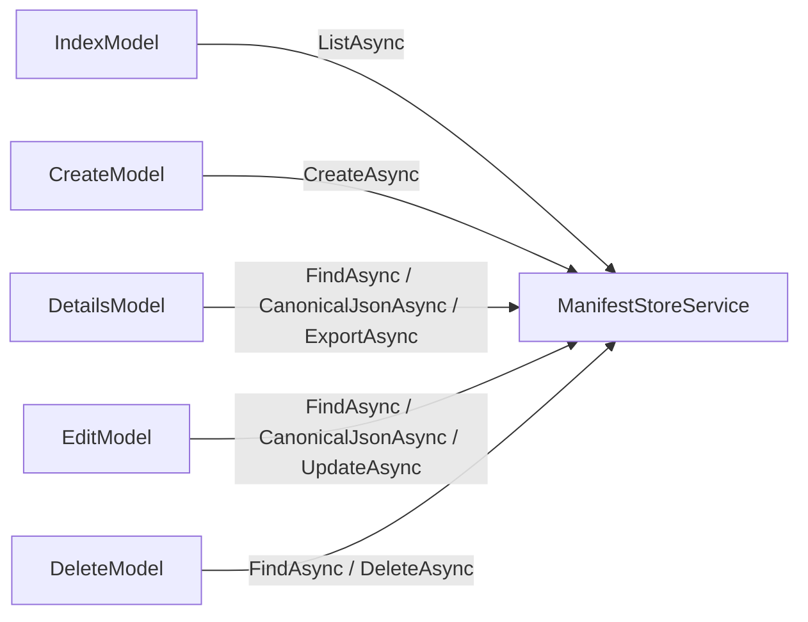
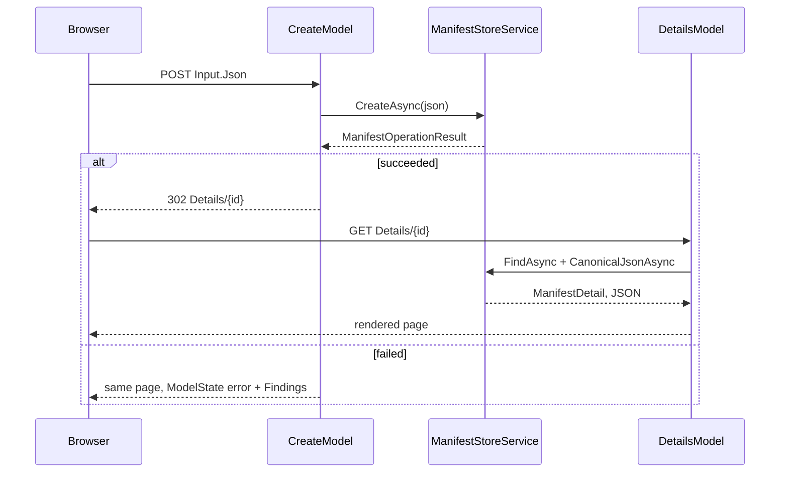

# Pages / Manifests

## Contents

- [Overview](#overview)
- [Files](#files)
- [Types](#types)
  - [IndexModel](#indexmodel)
  - [CreateModel](#createmodel)
  - [DetailsModel](#detailsmodel)
  - [EditModel](#editmodel)
  - [DeleteModel](#deletemodel)
- [Diagrams](#diagrams)
- [See also](#see-also)

## Overview

The CRUD surface of the application: list/search, create, view + export, edit, and delete — one Razor Page + `PageModel` pair per operation, all backed by [`ManifestStoreService`](../../Services/README.md#manifeststoreservice). None of these page models touch EF Core directly.

## Files

| File | Primary type(s) | Responsibility |
|---|---|---|
| `Index.cshtml` / `.cs` | `IndexModel` | List manifests, optional IIIF-id/label search |
| `Create.cshtml` / `.cs` | `CreateModel` | Paste Presentation 2.x/3.0 JSON, validate, and store |
| `Details.cshtml` / `.cs` | `DetailsModel` | View a manifest's canonical Presentation 3 JSON; export to 3.0/2.1/2.0 |
| `Edit.cshtml` / `.cs` | `EditModel` | Replace a manifest's JSON, guarded by optimistic concurrency |
| `Delete.cshtml` / `.cs` | `DeleteModel` | Confirm and delete a manifest |

## Types

| Type | Kind | Page route |
|---|---|---|
| `IndexModel` | `sealed class : PageModel` | `/Manifests` |
| `CreateModel` | `sealed class : PageModel` | `/Manifests/Create` |
| `DetailsModel` | `sealed class : PageModel` | `/Manifests/Details/{id:guid}` |
| `EditModel` | `sealed class : PageModel` | `/Manifests/Edit/{id:guid}` |
| `DeleteModel` | `sealed class : PageModel` | `/Manifests/Delete/{id:guid}` |

### IndexModel

- **Properties:** `Query : string?` (`[BindProperty(SupportsGet = true)]`), `Manifests : IReadOnlyList<ManifestListItem>`.
- `OnGetAsync` calls `store.ListAsync(Query, ct)`. The view renders label, IIIF id, source version, canvas/range counts, and last-updated, with links to Details/Edit/Delete.

### CreateModel

- **Properties:** `Input : ManifestInputModel` (`[BindProperty]`, pre-filled on `OnGet` with a small embedded sample Manifest), `Findings : IReadOnlyList<ManifestFinding>`.
- `OnPostAsync` calls `store.CreateAsync(Input.Json, ct)`. On failure, the SDK's validation findings and the error message are shown on the same page via the [`_Findings` partial](../Shared/README.md#_findingscshtml); on success it redirects to `Details` with a `TempData` status message.

### DetailsModel

- **Properties:** `Manifest : ManifestDetail`, `Json : string` (the canonical Presentation 3 rendering), `Label` (via [`IiifLabelFormatter`](../../Services/README.md#iiiflabelformatter)).
- `OnGetAsync` loads the manifest and its canonical JSON.
- `OnGetExportAsync(id, target)` maps `target` (`"v2.0"` / `"v2.1"`, defaulting to 3.0) to `IiifPresentationVersion`, re-serializes via `store.ExportAsync`, and returns it as a downloadable `application/json` file named `iiif-manifest-{id}-{target}.json`.

### EditModel

- **Properties:** `Input : ManifestInputModel` (`[BindProperty]`), `Id : Guid`, `Findings : IReadOnlyList<ManifestFinding>`.
- `OnGetAsync` loads the manifest's canonical JSON and current `Version` into `Input`, so the form round-trips the concurrency token as a hidden field.
- `OnPostAsync` calls `store.UpdateAsync(id, Input.Version, Input.Json, ct)`. A `ConcurrencyConflict` result surfaces through the same `ModelState` error path as any other failure — the page doesn't special-case it visually beyond the message text.

### DeleteModel

- **Properties:** `Manifest : ManifestDetail`, `Label`, `Version` (`[BindProperty]`, hidden field carrying the concurrency token).
- `OnPostAsync` calls `store.DeleteAsync(id, Version, ct)`; on failure it reloads the manifest so the confirmation page can be re-rendered with the error instead of losing context.

## Diagrams

### Page-to-service calls

### Create → Details round trip

## See also

- [Services](../../Services/README.md) — `ManifestStoreService`, the only dependency of every page model here
- [Models](../../Models/README.md) — the DTOs these pages bind and render
- [Pages/Shared](../Shared/README.md) — the layout and the `_Findings` partial used by Create and Edit

[↑ Back to top](#contents)
