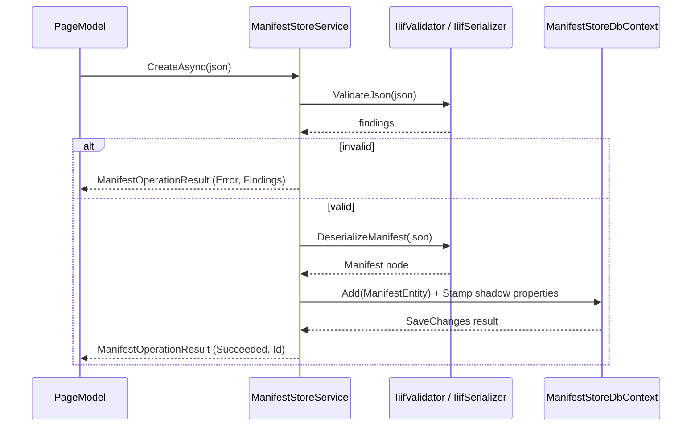
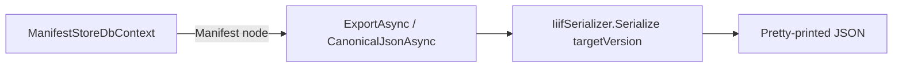

# Services

## Contents

- [Overview](#overview)
- [Files](#files)
- [Types](#types)
  - [ManifestStoreService](#manifeststoreservice)
  - [IiifLabelFormatter](#iiiflabelformatter)
- [Diagrams](#diagrams)
- [See also](#see-also)

## Overview

The application's only business-logic layer: validate → normalize → persist/query/export, on top of [`ManifestStoreDbContext`](../Data/README.md#manifeststoredbcontext) and the SDK's `IiifValidator`/`IiifSerializer`. [Pages/Manifests](../Pages/Manifests/README.md) call this and nothing else — there's no direct EF Core access from the page models.

## Files

| File | Primary type(s) | Responsibility |
|---|---|---|
| `ManifestStoreService.cs` | `ManifestStoreService` | List/find/create/update/delete/export for manifests |
| `IiifLabelFormatter.cs` | `IiifLabelFormatter` | Picks a display label out of a language map |

## Types

| Type | Kind | Summary |
|---|---|---|
| `ManifestStoreService` | `sealed class` | CRUD + export, scoped per request via DI |
| `IiifLabelFormatter` | `static class` | One pure helper, no state |

### ManifestStoreService

- **Namespace:** `IIIF.POC.PostgreSqlRelationalV3Store.Services`
- **Constructor:** primary constructor over `ManifestStoreDbContext`; registered `AddScoped` in [`Program.cs`](../../README.md#run).
- **Key Methods:**
  - `ListAsync(query, ct) : Task<IReadOnlyList<ManifestListItem>>` — optional case-insensitive (`ILike`) filter over IIIF id and label, newest-updated first.
  - `FindAsync(id, ct) : Task<ManifestDetail?>` — a split query projecting the shadow properties plus the full `Manifest` node.
  - `CreateAsync(json, ct) : Task<ManifestOperationResult>` — validates and normalizes the input (see `Prepare` below), rejects a duplicate IIIF id, then inserts.
  - `UpdateAsync(id, expectedVersion, json, ct) : Task<ManifestOperationResult>` — validates and normalizes, rejects an IIIF id collision with a *different* row, then replaces the aggregate inside a transaction: clears the change tracker, deletes the owned rows explicitly (`PurgeOwnedRowsAsync`), re-attaches the entity with the original `Version` as the concurrency check, and saves. A `DbUpdateConcurrencyException` is caught and reported as `ConcurrencyConflict` rather than surfaced as a generic error.
  - `DeleteAsync(id, expectedVersion, ct) : Task<ManifestOperationResult>` — attaches a stub entity with the expected version as the concurrency token and removes it; PostgreSQL cascades the owned rows.
  - `ExportAsync(id, targetVersion, ct)` / `CanonicalJsonAsync(id, ct) : Task<string?>` — re-serialize the stored `Manifest` node to a specific Presentation version via `IiifSerializer.Serialize`, pretty-printed.
  - `Prepare(json) : PreparedManifest` *(private)* — runs `IiifValidator.ValidateJson`, collects findings, bails out on validation failure, otherwise detects the source Presentation version and deserializes to the SDK's `Manifest` type.
  - `Stamp(entry, manifest, sourceVersion, updatedAtUtc)` *(private)* — recomputes every shadow property (`IiifId`, `Label` via `IiifLabelFormatter`, `SourceVersion`, a SHA-256 `ContentHash` of the canonical Presentation-3 JSON, `CanvasCount`, `StructureCount`, `UpdatedAtUtc`) after a create or update.
  - `PurgeOwnedRowsAsync(id, ct)` *(private)* — raw `DELETE` against each table directly owned by `manifests` (`manifest_behavior`, `manifest_homepage`, ..., `ranges`) before an update's re-insert; everything below those tables (e.g. `range_*`, `*_provider_*`) is removed by PostgreSQL's `ON DELETE CASCADE`. The table names are fixed literals, never derived from request input.
- **Concurrency:** every mutation carries the row's `Version` (the `xmin`-backed token from [`ManifestEntityConfiguration`](../Data/Configurations/README.md#manifestentityconfiguration)) as the original value EF Core checks against, so a stale edit fails with `ConcurrencyConflict` instead of silently overwriting a newer one.
- **Usage Recipe:**

  ```csharp
  var result = await store.CreateAsync(json, cancellationToken);
  if (!result.Succeeded) return Page(); // result.Findings has the validator's rule-by-rule detail
  ```

### IiifLabelFormatter

- **Namespace:** `IIIF.POC.PostgreSqlRelationalV3Store.Services`
- `FirstOrDefault(IReadOnlyCollection<Label>) : string` — the first non-blank label value across all languages, or `"Untitled Manifest"`. Used by `ManifestStoreService.Stamp` (for the searchable `list_label` column) and directly by the [Details](../Pages/Manifests/README.md#detailsmodel) and [Delete](../Pages/Manifests/README.md#deletemodel) page models (for the page heading).

## Diagrams

### Create / update flow



### Export flow



## See also

- [Data](../Data/README.md) — the `DbContext` this service wraps
- [Models](../Models/README.md) — every type this service produces
- [Pages/Manifests](../Pages/Manifests/README.md) — the only callers

[↑ Back to top](#contents)
